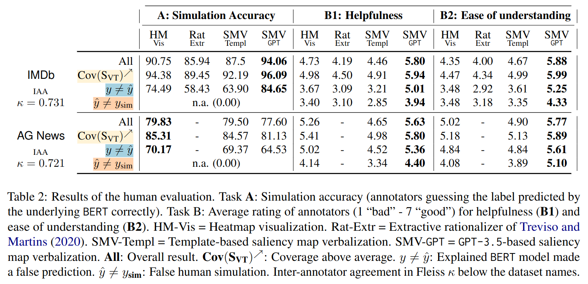

# Human evaluation

Our main results are summarized in this table:

* We conducted a first round of evaluations (`G0`) with four annotators, reflected in v1 of our paper, which only included SMV-Temp and HM-Vis.
* In a second round of evaluations with eight annotators, we extended the study to Extractive Rationales (Rat-Extr) and GPT-3.5-generated rationales (SMV-GPT). Here, we recalled two from the previous group to annotate the new data (`G3`) and recruited six new annotators, split into two groups (`G1` and `G2`).

You can see the Excel sheet for `G1` and `G2` in *SMV Annotation (Group x).xlsx*.

For more details, please consult [our paper](https://arxiv.org/abs/2210.07222).