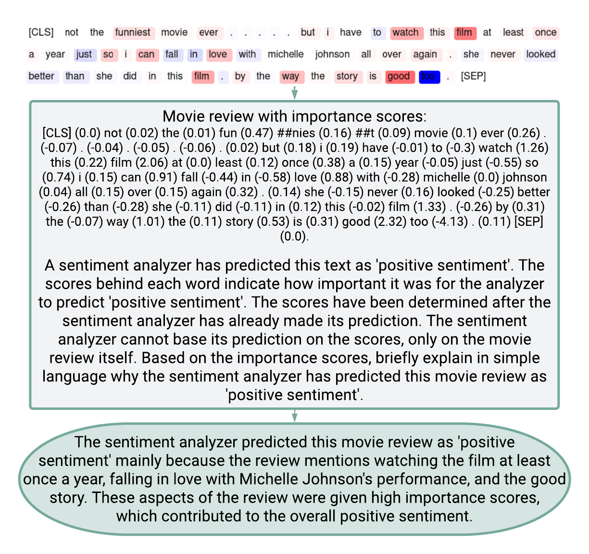

# GPT-3.5 Saliency Map Verbalizations

## Run

1. In *ChatGPT_class.py*, change the `api_key = ""` and `organization = ""` (l. 7) to your OpenAI credentials.
2. *SMV_Lists.py* includes the IDs for the IMDb and AG News datasets that we used in our human evaluation. 
   You can change it to your desired data points, but I would advise not to put the entire data in there, because it will not be cheap. ; )
3. Decide on your OpenAI model of choice in *ChatGPT_test.py* (l. 8). At the time when we conducted our study, `"gpt-3.5-turbo"` was the best one available.
4. `python ChatGPT_test.py` will produce the rationales based on the IDs in *SMV_Lists.py* and write them to Weights & Biases (you may need to log in first).
